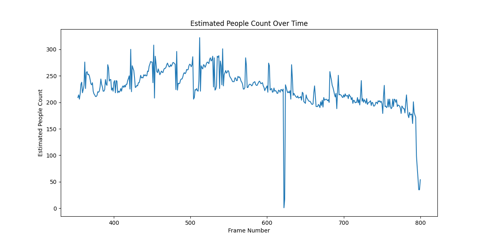

# People-counting

This challenge was observed with 2 aspects. The first one was using pre-trained weights of the well-renowned object detection model, YOLOv10. Expectedly, the results given were highly unsatisfactory. Leading me to think of a method that relies purely on Computer Vision techniques like Movement Tracking and Density Estimation.

## Machine Learning
### YOLOv10

Understandbly, the COCO dataset on which YOLO versions are trained, don't cover images like the drone footages of people walking on the bridge. Hence, as visible in the notebook, most of the frames have a 'frisbee' or a 'car' falsely recognized, and not a 'person'.

### Roboflow API

Since finding relevant data for this particular use-case, images or image frames of a video of drones capturing people walking on bridge, was not publicly available, I though of using Roboflow. Leveraging third-party tools like Roboflow was only considered worthy of the attempt, since the online repository specializing in Vision tasks has grown immensely over the last few years. Hence, their popular model 'people-detection-o4rdr' was called on the API. Before spending time on the actual video footage, I decided to test it on a sample image, like I did with YOLO. As seen in the notebook, it has trouble recognizing all the 'humans' on a relatively 'easy' image.

### Future Improvements

Leveraging the power of fine-tuning, we should aim to curate a custom dataset specific to this use-case. There are many state-of-the-art tools for labelling the images accordingly. Once the dataset is finalized, we can train the YOLOv10 on the dataset. This would undoubedtly improve the inference performance.

## Computer Vision - Movement Tracking and Depth Estimation
### Code with Adaptive Thresholding and Super-Resolution:

This version represents the most sophisticated approach among the three. I chose to do this because based on the other versions, objects like 'roads' and 'green patches like trees' were also considered. So, below lies the purpose and rationale of each aspect encapsulated within.

a. Super-Resolution:
- Implementation: Used OpenCV's DNN Super-Resolution module with the ESPCN model.
- Purpose: To enhance the quality and resolution of each video frame. Since the video downloaded from YouTube was not of the highest resolution.
- Rationale: Higher resolution frames can could reveal more detailed movement, especially because there is quite a lot of distance between drone and people.

b. Adaptive Thresholding:
- Implementation: Calculated a dynamic threshold for each frame based on the mean and standard deviation of pixel intensities in the movement analysis.
- Purpose: To automatically adjust the sensitivity of movement detection based on the current frame's characteristics.
- Rationale: Adaptive thresholding can handle varying lighting conditions and movement intensities across different parts of the video more effectively than a fixed threshold.

c. Three-Frame Analysis:
- Implementation: Used three consecutive frames for movement analysis.
- Purpose: To detect consistent movement and reduce noise.
- Rationale: Comparing three frames helps in identifying genuine movement patterns while filtering out random fluctuations or camera noise.

d. Rolling Average:
- Implementation: Calculated a moving average of the estimated people count over a window of frames.
- Purpose: To smooth out rapid fluctuations in the crowd estimate.
- Rationale: Crowd sizes typically don't change drastically from frame to frame; a rolling average provides a more stable and realistic estimate.

### Code and with Super-Resolution and without Adaptive Thresholding:

This version maintains the super-resolution and three-frame analysis but uses a fixed threshold for movement detection.

Key Differences:
- Fixed Threshold: Used a constant value (movement_threshold) for all frames.
- Rationale for Removal: To assess whether the overhead of adaptive thresholding is justified. A fixed threshold is simpler and faster but may be less robust to changing scene conditions, as we can see with the .

### Code without Image Frame Enhancement:

This version removes the super-resolution step, focusing on basic movement analysis with the original video resolution, which is 360p.

#### Key Differences:
- No Super-Resolution: Frames are processed at their original resolution.
- Rationale for Removal: Upscaling the resolution is a computationally expensive step. This version is faster and less resource-intensive but could also miss subtle movements in lower-quality videos.

#### General Approach in All Versions:
- Frame Differencing: Used to detect changes between 3 consecutive frames.
- Density Estimation: Calculated based on the percentage of pixels showing movement.
- Scaling Factor: Applied to convert movement percentage to an estimated number of people.
- Visualization: Displayed processed frames and movement masks for visual feedback.

#### Rationale for Different Versions:
- Complexity vs. Performance: Each version represents a trade-off between algorithmic sophistication and computational efficiency.
- Adaptability: The most complex version (with adaptive thresholding and super-resolution) is designed to be more adaptable to various video qualities and conditions.
- Resource Consideration: Simpler versions may be more suitable for real-time processing or on devices with limited computational resources.

In conclusion, comparing all the three versions might tell use subtle nuances of using pure computer vision techniques. In all the three, we notice that the latter part of the video, which is after 00:20, even though the no.of people increases on the bridge, the density estimation of the bridge decreases due to the distance. 

### Future Improvements

We can implement a Region Of Interest (ROI) selection of a specific part of the video. This would remove the false positives that are being counted, like the trees and the roads. This is also visible with the graphs. We aim to have less fluctuations in the graph with increasing curve, as the people in the video increase. Also, changing the moving_threshold and density_scale_factor, and tweaking them might allow us to reach a convincing measure of the people.

### Evaluation

.png)
.png)

| Version Name| Random Number |
|---------------------------------------------|---------------|
| Adaptive Thresholding with Super-Resolution | 225 |
| Fixed Threshold with Super-Resolution | 108 |
| Fixed Threshold and Original Resolution | 118 |
